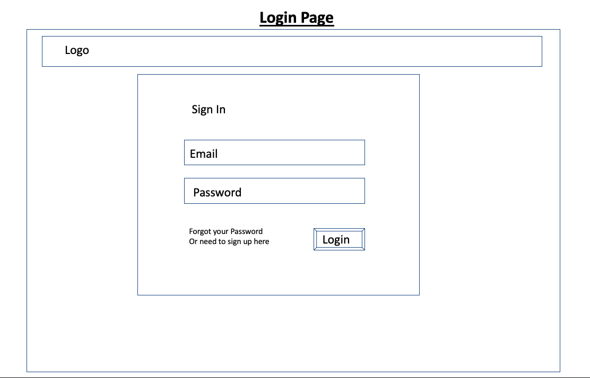
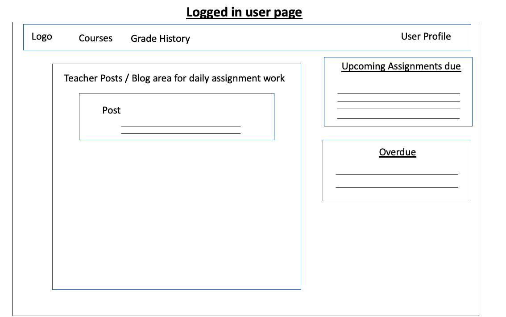
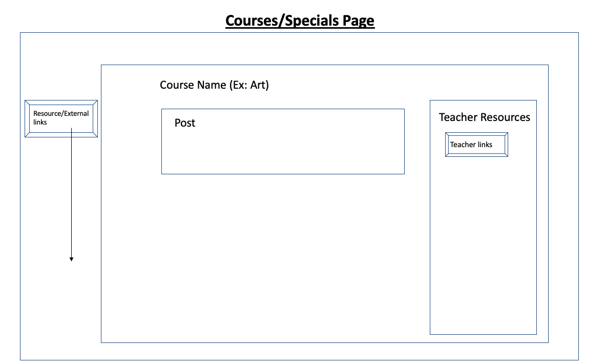
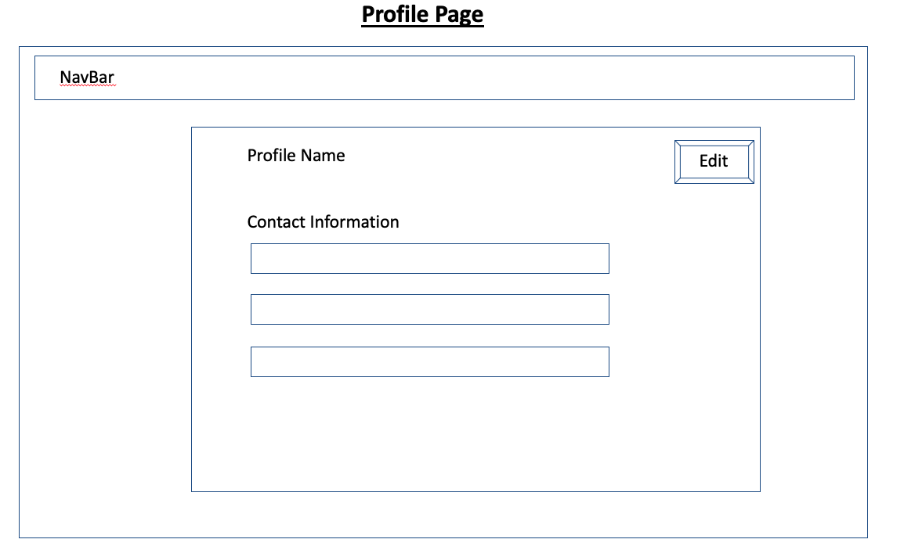

# School-Connected Web App

## Why School-Connected
With COVID approaching unexpectedly, I saw the need for a better way to communicate between teachers and students as I watched my daughter have to abruptly adjust to distance learning. My goal for building this web app is to make a very user centered design for teachers and students. 

Teachers can clearly communicate daily lessons, provide all the needed resources and students will have a very easy to use UI that clearly displays lessons for the day, overdue assignments and upcoming events. Teachers can easily create,edit, and delete courses, all with a simple UI to interact with, limiting their time in setting up.

### Backend API
Repository for the backend API you communicate with can be found [here]('https://github.com/oscar-valen115/school-connected-api')  
Production URL: `https://school-connected-api.herokuapp.com`
## Wireframes

